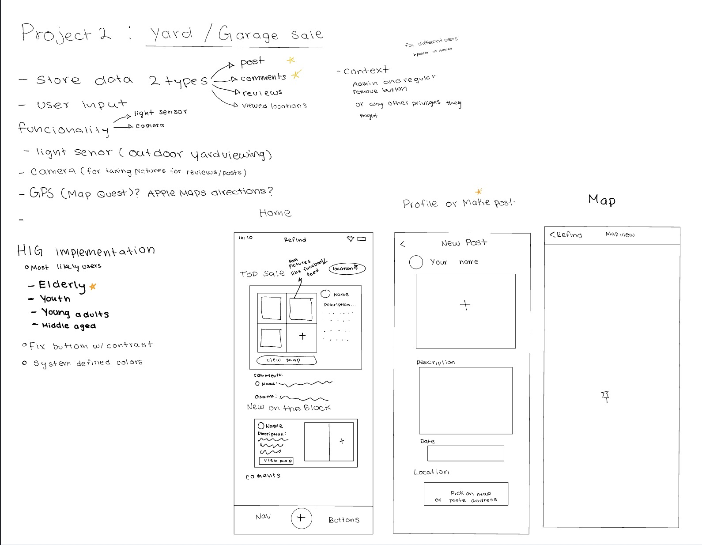

ReFind App

Description:
This app is aimded at yard and thrift lovers. It makes the process of finding yard and garage sales in your area easier. Users will be able to post
about their sales that will be linked to an intergrated map in the app.

HIG implementation:

For my first HIG implementation I decided to improve my typography to ensure that the text is more legible. I accomplished this through font weight and size adjustments so that they worked in harmony together. Since I was working on the text, it made sense to also make improvments to the button padding and spacing. That way it would reduce the chance of misclicks.

Lastly, I made color adjustmnets to the layout of my app. While reading the HIG documents, I reconsidered my color choices due the topic of color blindness. To make it more inclusive, I researched colors that would work best for colorblindess and implemented those colors to my app. 
